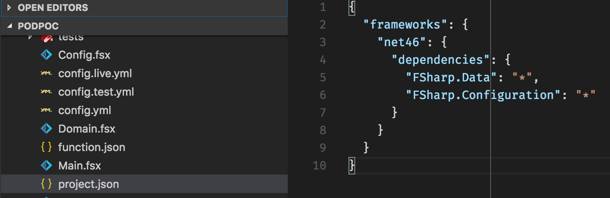
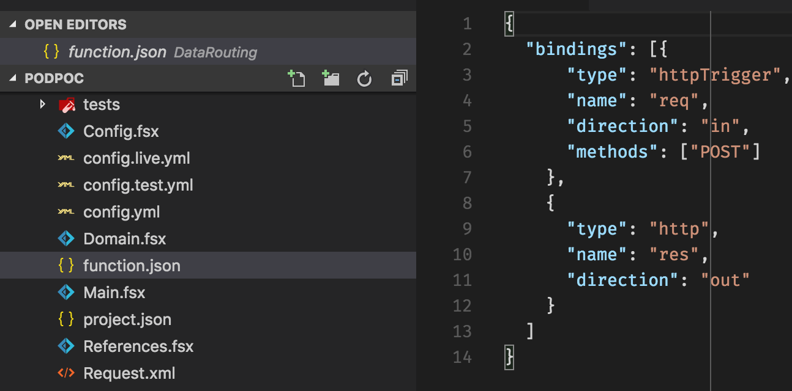
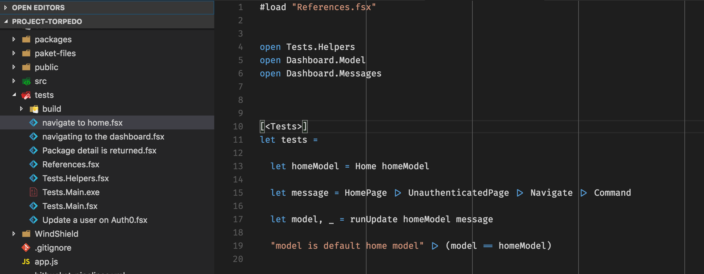
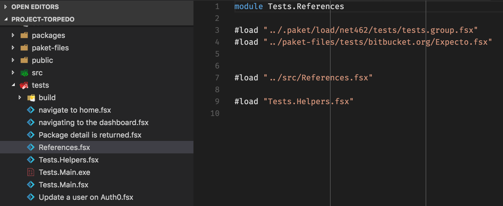
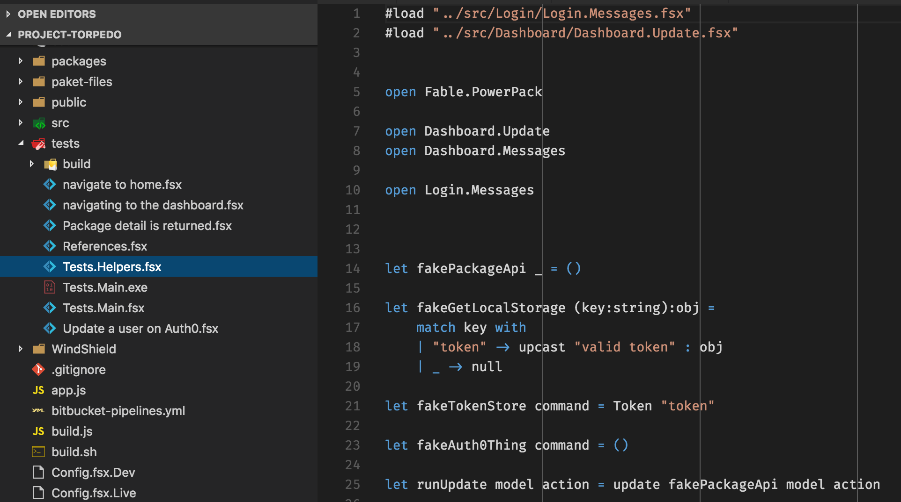

- title : F# Exchange - Lightning Talk Session
- description : Using F#, Azure Functions, Fable and Shell Scripts
- author : Jon Canning, Mark Gray and Ronnie Barker
- theme : night
- transition : default

***

## Using F#, Azure Functions, Fable and Shell Scripts & more ....

- Jon Canning (@JonCanning)
- Mark Gray (@MarkRGray)
- Ronnie Barker (@Ronnie Barker)

***

## Part One

---

### What are we doing?
- Building a system to control the services to SIMs, Data Usage, SMSs, Call Usage.
- We do not hook into the mobile network infrastructure, we use APIs to cause the effects.

---

### Constraints (self imposed)
- We love F# (except Ronnie, he is learning to love it) and will use it
- Not keen on full blown msbuild projects.

---

### What challenges did we face?
- There were some unknowns regarding .Net and projects.
- We had a strong opinionated CSharper in the team.
- We didn’t know how to utilise Fable.
- Azure Functions is new.
- Little time to do it all.
- Only 3 people.

---

### Integrating with Azure Functions

- Azure uses Nuget to obtain dependencies

---

## Our C# Developer

- Syntax and convention pain (preferred strict mode)
- Readability
- Concepts
- Writing maintainable code
- Navigating the code

---

## What's the Solution?

---

## Roll your Own!

---

## How?

- A little Paket goes a long way
- Basic Shell scripting as glue
- VS Code + Ionide / Vim / Emacs
- Azure Functions
- Fable
- Expecto and Canopy

***

## Part Two

---

### Paket Wins

- Paket introduced include scripts (now load scripts)
- We created shell functions to put into our bash profiles

    function paket()
    { 
        mono paket.exe "$@"
    }

    function paketGen() 
    { 
        rm -rf paket-files && \
        paket install && \
        paket generate-load-scripts type fsx framework net462
    }

---

### F# scripts hold it all together

With fsx we can #load the scripts generated by Paket, and link all our fsx together.

---

### Shell scripts to execute our Expecto tests

> **http://bit.ly/sh-run-tests**

---

### Of course we've automated

Build script:
> **http://bit.ly/build-script-sh**

---

### Bonus

Here is a sample of the build system config:
> **http://bit.ly/bb-build-yml**

---

### Fable mailboxes to handle multiple apps

To have different elements of the app we created separate apps for each feature.
> **http://bit.ly/mailbox-multi**

---

### And a sample update function

> **http://bit.ly/sample-update**

---

### But what about the Azure Functions?

Here is a sample of how we bootstrap our Azure Function:

    #if !LOCAL
    #r "Microsoft.ServiceBus"
    #r "Newtonsoft.Json"
    #r "System.Runtime.Serialization"
    #endif

    #load "Main.fsx"

    open Microsoft.Azure.WebJobs.Host
    open System.Net.Http

    let run (req: HttpRequestMessage, log: TraceWriter) = Main.mainLive req

---

## Of course you need to define the func type

Using the function.json file, the azure convention, we can specify the type of function. Here we have a HttpTrigger:

---

## Tests

**How we currently use Expecto:**

---

## References.fsx

**The References.fsx:**

---

## Tests.Helpers.fsx

**The Tests.Helpers.fsx:**

***

## Part Three

---

### Learning

- Shell scripting can be fun, even if it is obtuse
- Azure Functions is really cheap, and I mean REALLY!
- Fable is extremely cool and useful, we made a multi app, app...
- Arch is merging into Elmish so we will need to redo lots...
- Fable works with .net core now so more (GOOD) changes there...
- The Fable community is awesome, answering my questions on a Sunday!

---

### Most importantly we learned

> **Kryzsztof makes what we do redundant quite quickly!**

---

### Demo

***

## Thank you
> Any questions?

***
